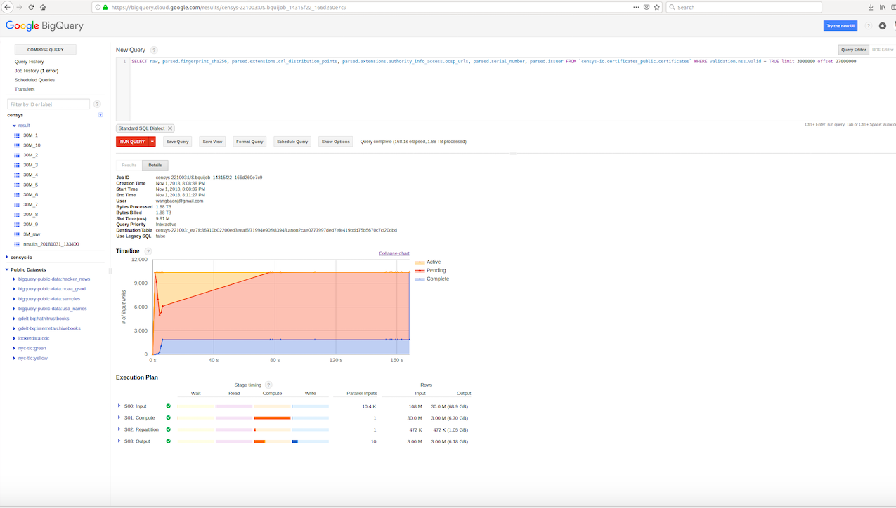

This collection of tools is designed to download certificates from Censys, classify them into revoked and non-revoked.
This tool is largely based on casebenton's github (https://github.com/casebenton/certificate-revocation-analysis). The main improvement is to download Censys database using Google BigQuery and also solve several bugs. These tools were built from scratch, using the original CRLite research code as a design reference and closely following the documentation in their paper. 

## Dependancies
1. A [Censys](https://censys.io) Researcher Account (for downloading certificates)
2. **About 100GB of space to store certificates and associated data**
3. Python 2 & Python 3 (default is to use Python 2 except when explicitly noted)
4. Aria2c (or wget or Curl)
5. pyopenssl (at least version 16.1.0)
6. Lots of patience, one of the scripts take two days to fininsh.

## Instructions
### Part A: Obtaining all NSS-trusted Certificates
1. After obtaining a researcher account on [Censys](https://censys.io),
perform the following SQL on Google Bigquery to collect 30 million valid NSS-trusted certificates.
```
SELECT raw, parsed.fingerprint_sha256, parsed.extensions.crl_distribution_points, parsed.extensions.authority_info_access.ocsp_urls, parsed.serial_number, parsed.issuer FROM `censys-io.certificates_public.certificates` WHERE validation.nss.valid = TRUE limit 30000000;
```

Get the result in JSON format.

2. Download the exported certificates, unzip them and place their contents in a single, unified file.
Unzip with `gzip -u *.gz`, then unify the files with `cat *.json > certificates.json`. Then you can delete all files except for `certificates.json`.

### Part B: Determining CRL Revocations
0. Set `get_CRL_revocations` as the working directory. This folder contains all scripts for Part B.

1. Extract the CRL distribution points by running `python extract_crls.py`. This
script will output three files: a file of all certificates which have listed CRLs(`../certs_using_crl.json`),
a file of all certificates which do not list a CRL(`../certs_without_crl.json`),
and a list of all CRL distribution points (`CRL_servers`).

2. Sort and eliminate duplicate entries in `CRL_servers` using the command
`sort -u CRL_servers > CRL_servers_final`.

3. Download all of the CRLs listed in `CRL_servers_final`. First create a new subdirectory `raw_CRLs`, set it as the working directory, then run `aria2c -i ../CRL_servers_final -j 16`. There are some errors when downloading these certificates, I just ignore them. 

4. Set the working directory back one level up (to `get_CRL_revocations`).
Run `python3 build_megaCRL.py` script **(note that this must use python3 and pyopenssl version 16.1.0 and above)**.
This will output `megaCRL`, which contains all revocation serial numbers
organized by CRL. Also you can use `python count_serials.py` to see the total number of revocation serials that are
contained in the megaCRL.

5. Make a new subdirectory `revokedCRLCerts`, then match the revocation serial numbers to known certificates using `python build_CRL_revoked.py`.
This script uses multiprocessing to get around the I/O bottleneck,
and you may need to adjust the number of "worker" processes to get optimal
speed on your machine. Each worker has a dedicated output file, so after the script you
will need to combine each output file into a single, final result using
`cat revokedCRLCerts/certs* > ../final_CRL_revoked.json`.

6. Count the number of actual revoked certificates using `wc -l final_CRL_revoked.json`.

### Part C: Determining OCSP Revocations
0. Set `get_OCSP_revocations` as the working directory. This folder contains all scripts for Part C. Make a subdirectory called `OCSP_revoked`.

1. Use `python build_OCSP_revoked.py` to determine all Let's Encrypt revocations.
This tooling replicates the process of the CRLite authors, and I believe they made this
design choice to only include OCSP for Let's Encrypt based off the statistic that the
vast majority of OCSP-only certificates are issued by them. After the script completes,
combine the results of each worker into a final output file with
`cat OCSP_revoked/certs* > ../final_OCSP_revoked.json`.

### Part D: Generate final revoked and unrevoked certification fingerprint
0. Set `build_filter` as the working directory. This folder contains all scripts for Part D.
Make subdirectories `final_unrevoked` and `final_revoked`.

1. Use `python build_final_sets.py` to convert the data created from the steps above into a single
set of all revoked certificates and all valid certificates. This script uses multiprocessing,
so after running the script you will need to use `cat final_unrevoked/*.json > ../final_unrevoked.json`
and `cat final_revoked/*.json > ../final_revoked.json` to combine the results of the individual
workers into a single file. Finally use `sort -u final_revoked.json > final_revoked.json` and `sort -u final_unrevoked.json > final_unrevoked.json` to remove potentical duplicate ones.

